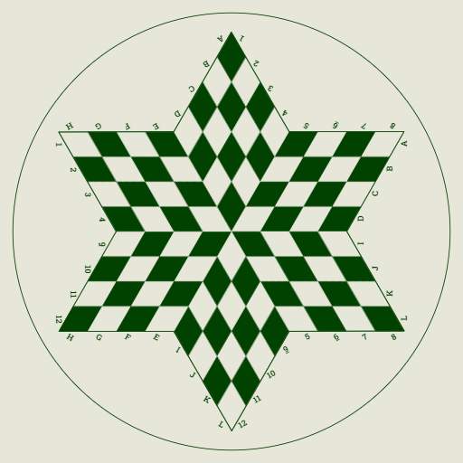

# HTML Canvas Playground
- a place for me to experiment with HTML Canvas

## Table Of Contents
* [3 Player Chess Board](#3-player-chess-board)

### [3 player chess board](https://github.com/calebsg225/html-canvas-playground/blob/main/src/scripts/chess3p.ts)

