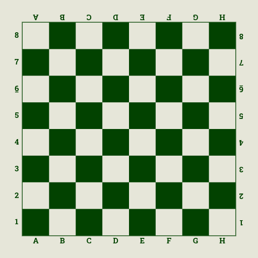
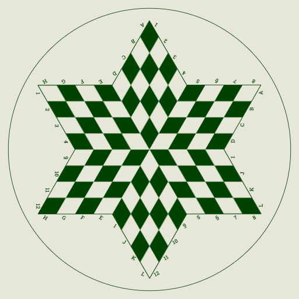
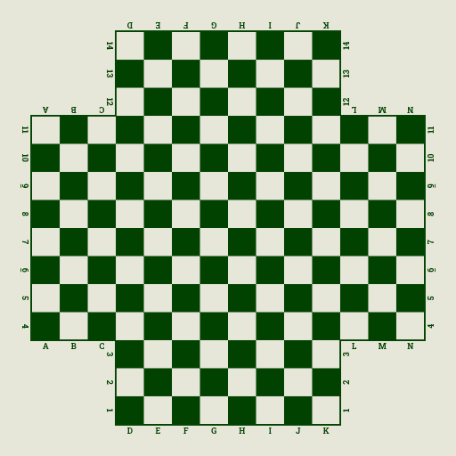

# HTML Canvas Playground
- making things for random projects

## Table Of Contents
- [2 Player Chess Board](#2-player-chess-board)
- [3 Player Chess Board](#3-player-chess-board)
- [4 Player Chess Board](#4-player-chess-board)

### 2 player chess board

Added a two player chess board for completion. I don't plan on getting this one printed on a mousepad like the other boards,
many already exist. Maybe later.

### 3 player chess board

I designed this with the intention of getting a custom mousepad made, like the ones for regular two player chess boards, just much larger.
I've done just that, with a higher resolution image than the one shown below.
The ring around the board is to make cutting the thing out easier, much cleaner than cutting it freehand.
I considered making the cutout hexagonal, but I already have one like that so I opted for the circle.
I can always go back and cut it out that way in the future. Its alot easier to freehand a hexagon than a circle!

### 4 player chess board

This is also designed with the intention of getting it printed on a mousepad. This board along with the three player board are part
of an ongoing project.

